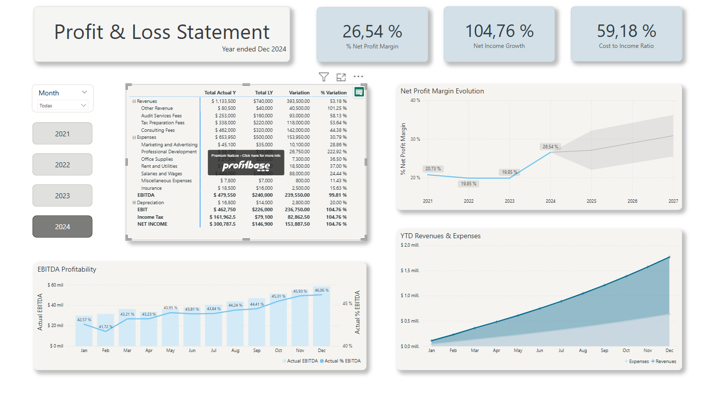

# Profit-Loss-Statement
Dashboard para análisis financiero en Power BI.

# 📊 Profit & Loss Dashboard - Power BI

Este proyecto muestra un dashboard financiero interactivo desarrollado en Power BI, enfocado en el análisis del estado de resultados.

## 🧾 Objetivo

Diseñar y desarrollar un dashboard de Power BI que presente eficazmente datos financieros para la toma de decisiones, en un formato visualmente atractivo y facil de usar.

## 📌 Tareas

    1. Data Preparation: 
    Importación del conjunto de datos proporcionado en formato `.xlsx`. Transformación y limpieza realizadas con Power Query.

    2. Dashboard Design: 
    Creación de las medidas DAXs que hicieron posible el diseño de los indicadores y de las visualizaciones.
    Se incorporaron funciones interactivas, como filtros, slicers y drill-downs. Se crearon indicadores clave de rendimiento y análisis de tendencias, para supervisar el rendimiento financiero a lo largo del tiempo e identificar áreas de mejora.

## 📊 Indicadores Clave

- ✅ % Net Profit Margin
- ✅ Net Income Growth
- ✅ Cost to Income Ratio
- 📈 Evolución mensual de EBITDA
- 📊 Análisis YTD de ingresos y egresos
- 🔄 Variación absoluta y porcentual vs. año anterior

## 🛠️ Herramientas utilizadas

- Power BI
- Power Query
- DAX
- Modelado de datos financieros

## 📷 Capturas del dashboard

## 💡 Autor

Noelia Adagio 
📫 adagionoelia@gmail.com 🌐 [LinkedIn](https://www.linkedin.com/in/adagionoelia/)

---

¡Gracias por tu visita!
